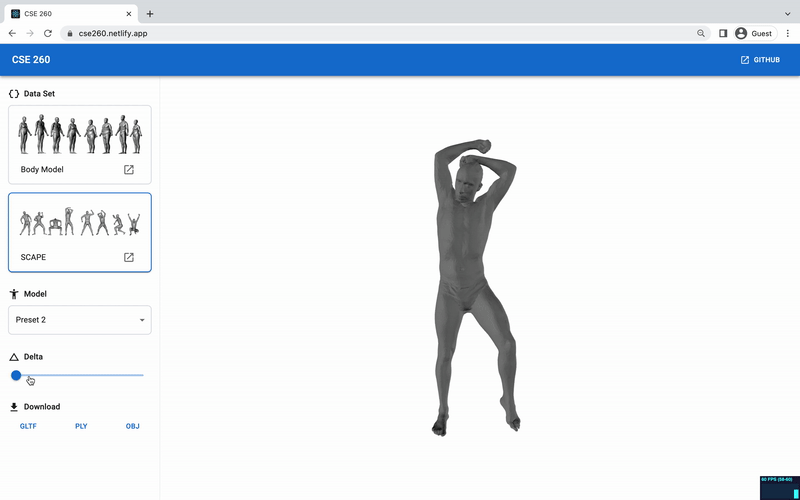

# CSE 260 Project

This project was built for the *CSE 260: Computer Graphics* class I am currently taking to allow users to make customizations on existing baseline models, build and aquire a new model in different format (glTF, OBJ, PLY).

Internally, it uses a linear algorithm to alter the existing baseline models. All of the calculations are made within the browser.

A live demo can be found at <https://cse260.netlify.app/>

## Model Datasets

This repo contains some of the 3D models from the following source:

### BodyModels

<https://graphics.soe.ucsc.edu/data/BodyModels/index.html>

### SCAPE

<https://graphics.soe.ucsc.edu/private/data/SCAPE/index.html>

## Development

To make changes to the underlying algorithm used, please refer to the `src/Human.tsx` file.

### Available Scripts

In the project directory, you can run:

#### `npm start`

Runs the app in the development mode.

#### `npm run build`

Builds the app for production to the `build` folder.
